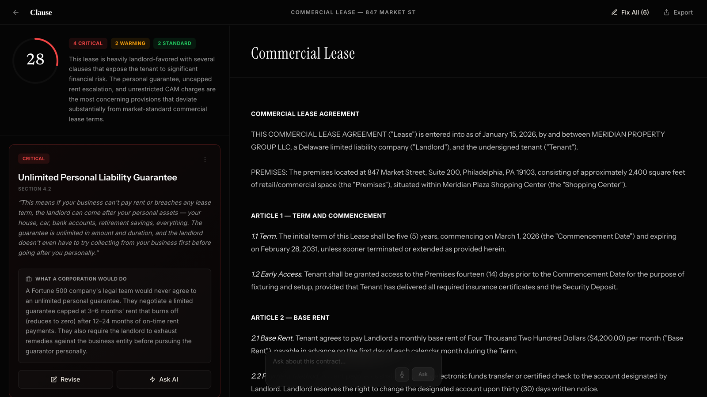
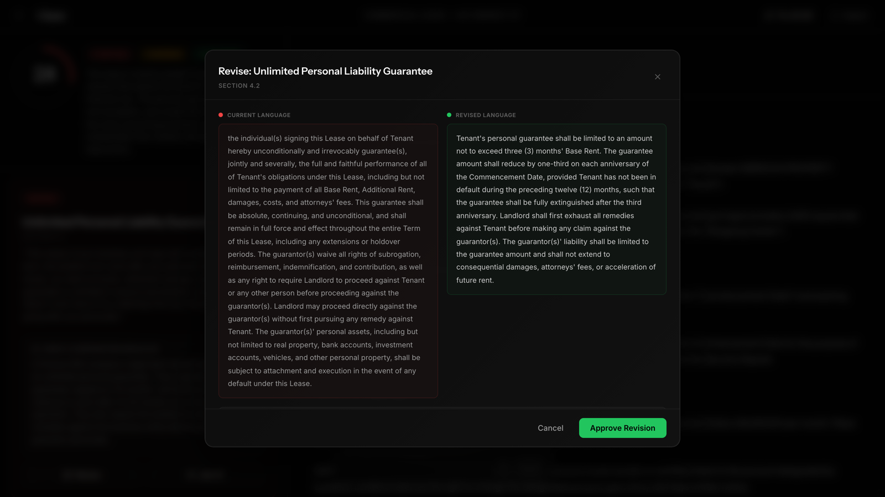
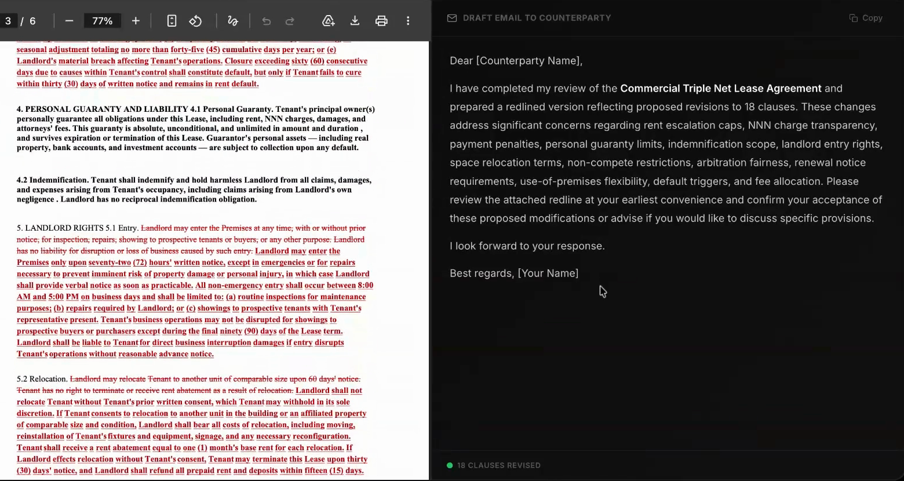
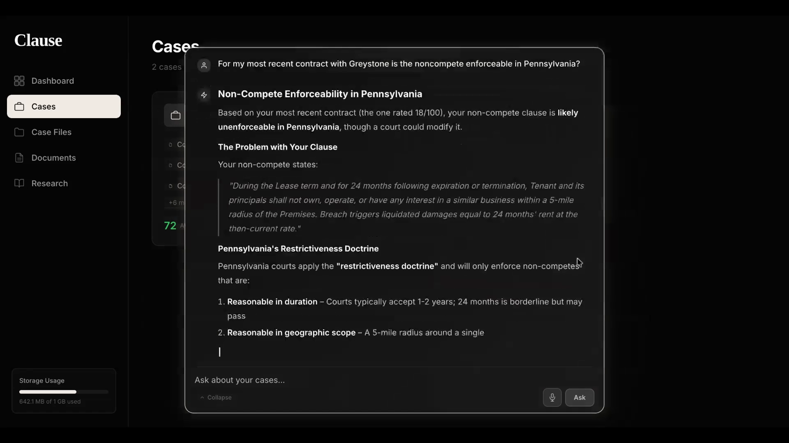
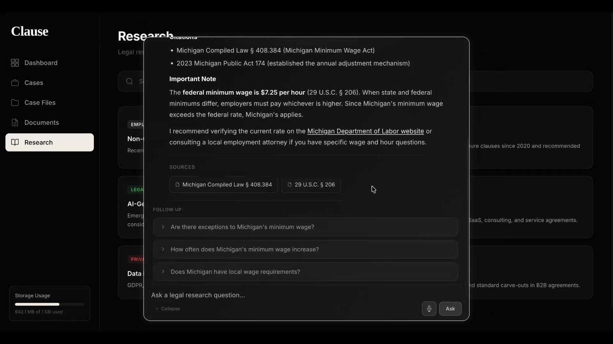

<div align="center">

# Clause

**Contract review for small business owners: the Fortune 500 legal team they can't afford.**

Upload a contract and Clause scores how ready it is to sign, flags the clauses that hurt you in plain English, shows what a big company's lawyers would push for, and generates a redlined counter-proposal you can send back.

**[▶ Watch the 3-minute demo](docs/media/clause-demo.mp4)** · Built solo in ~16 hours at a weekend hackathon (March 2026)



</div>

---

## The problem

Small business owners sign leases, vendor agreements, and service contracts written by the other side's lawyers. A big company sends every one of these to in-house counsel. A coffee shop owner signing a 5-year commercial lease usually can't justify paying a lawyer hundreds of dollars an hour, so they sign as-is and find out about the uncapped rent escalation or the unlimited personal guarantee later.

**Target user:** a non-lawyer owner of a 1 to 50 person business who is about to sign a contract and wants to know (1) *should I sign this?*, (2) *what exactly is bad about it?*, and (3) *what do I ask for instead?*

## What Clause does

| | |
|---|---|
| **1. Score it** | A 0 to 100 "ready to sign" score and a one-sentence verdict, so the owner knows how worried to be before reading anything. |
| **2. Explain it** | Each problem clause is tagged *critical*, *warning*, or *standard* and explained in plain English ("the landlord can come after your house, car, and retirement savings"). |
| **3. Benchmark it** | A **"What a corporation would do"** card for every clause. It describes how a Fortune 500 legal team would handle the same term, which gives the owner a concrete negotiating position. |
| **4. Fix it** | One-click **Revise** shows current vs. revised language side by side, and **Fix All** applies every revision at once. |
| **5. Send it** | Exports a **redlined PDF** (strikethroughs and insertions) and drafts the email to the counterparty. |
| **6. Ask about it** | A contract-aware AI chat, plus hands-free **voice mode**: "fix everything and export it" works by voice. |

<table>
<tr>
<td width="50%"><br/><sub><b>Revise:</b> AI-drafted replacement language, ready to paste into the contract</sub></td>
<td width="50%"><br/><sub><b>Redline export:</b> a marked-up PDF plus a drafted email to the other party</sub></td>
</tr>
<tr>
<td width="50%"><br/><sub><b>Cases:</b> contracts grouped by counterparty, with questions answered across all of them</sub></td>
<td width="50%"><br/><sub><b>Research:</b> legal questions answered with cited statutes and suggested follow-ups</sub></td>
</tr>
</table>

## Product decisions

Choices I made during the build and why:

- **Score "readiness to sign" instead of "risk."** The first version showed a risk score (high = bad), which conflicts with how people read every other score in their lives. I flipped it so 100 means a great deal, matching grades and credit scores, and so the number answers the question the owner actually has: "can I sign this?"
- **Benchmark against what big companies do instead of citing law.** Saying a clause is "unfavorable" doesn't help an owner negotiate. Saying "a Fortune 500 legal team would cap this guarantee at 3 to 6 months' rent" gives them a specific ask and the confidence that it's reasonable.
- **Show results while they load.** Analyzing a long contract can take a while. Instead of a spinner, the app navigates to the review page as soon as the file is uploaded, then streams in the score, summary, and each clause as the model writes them, with skeleton placeholders. The owner starts reading the first flagged clause while the rest are still being generated.
- **Choose the fast model over the smartest one.** I switched analysis from Claude Sonnet to Claude Haiku. It was faster and cheaper, and quality held up for this task. Users can still pick a bigger model for chat when they want deeper answers.
- **Group by who, not what.** Cases began grouped by contract type (leases, NDAs). I changed it to group by counterparty, because owners think about relationships ("everything I've signed with Greystone"), and that's how questions get asked.
- **End on an action.** Every flagged clause leads to an action: Revise, Fix All, Export, then send. The product's job is to get a better contract signed, not to produce a report.

## How it works

```
Upload (PDF / DOCX)
   │  text extracted server-side (pdf.js, mammoth), paragraphs rebuilt from layout
   ▼
/api/analyze ── Claude Haiku 4.5, streamed over Server-Sent Events
   │  partial JSON is parsed as it arrives → header, then clauses one by one
   ▼
Review UI ── score gauge · clause cards · highlighted contract · revise / fix all
   │
   ├─ /api/chat            contract-aware chat and research mode (with citations)
   ├─ /api/followups       suggested next questions
   ├─ Redline export       jsPDF, original vs. revised text with strikethroughs
   └─ Voice mode           Gemini Live API, real-time two-way audio over WebSocket,
                           function calling for "fix all" and "export"
```

**Stack:** Next.js 16 (App Router) · React 19 · TypeScript · Tailwind CSS 4 · Framer Motion · Anthropic Claude API · Google Gemini Live API · pdf.js · mammoth · jsPDF

## Run it locally

```bash
git clone https://github.com/loganstaples/clause.git
cd clause
npm install
cp .env.example .env.local   # add your API keys
npm run dev                  # http://localhost:3000
```

| Variable | Used for |
|---|---|
| `ANTHROPIC_API_KEY` | Contract analysis, chat, research, follow-ups |
| `GEMINI_API_KEY` | Voice mode only |

To try it without uploading a contract, click any template on the dashboard. It opens a sample commercial lease with a pre-built analysis.

## What I'd build next

- **Accounts and a real database.** Contracts are kept in the browser's localStorage, which was fine for a hackathon demo but not for real users.
- **Server-side voice sessions.** Voice mode currently passes the Gemini key to the browser. Production would issue short-lived session tokens from the server.
- **Jurisdiction awareness.** Whether a non-compete is enforceable depends heavily on the state. Asking for the user's state up front would make every explanation more accurate.
- **Validation with real owners.** The next step is putting this in front of 10 to 15 small business owners with contracts they've actually signed, measuring whether the redlines get accepted, and learning which clause types matter most.

---

<sub>Clause provides legal information, not legal advice. Always consult a licensed attorney before signing.</sub>
